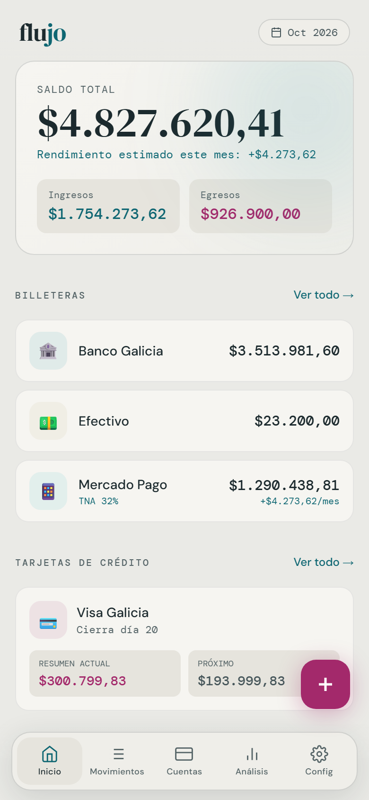
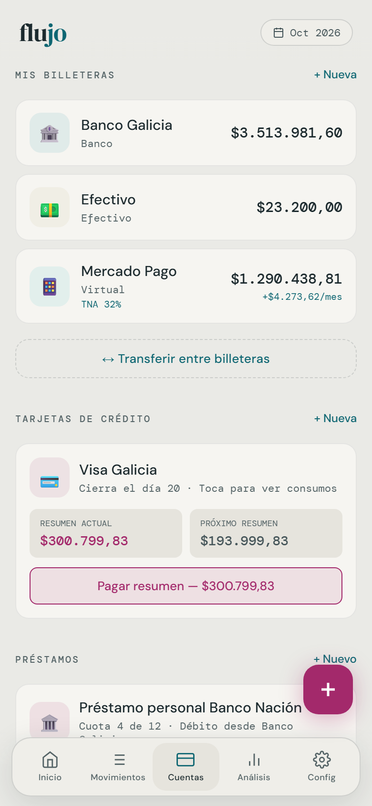
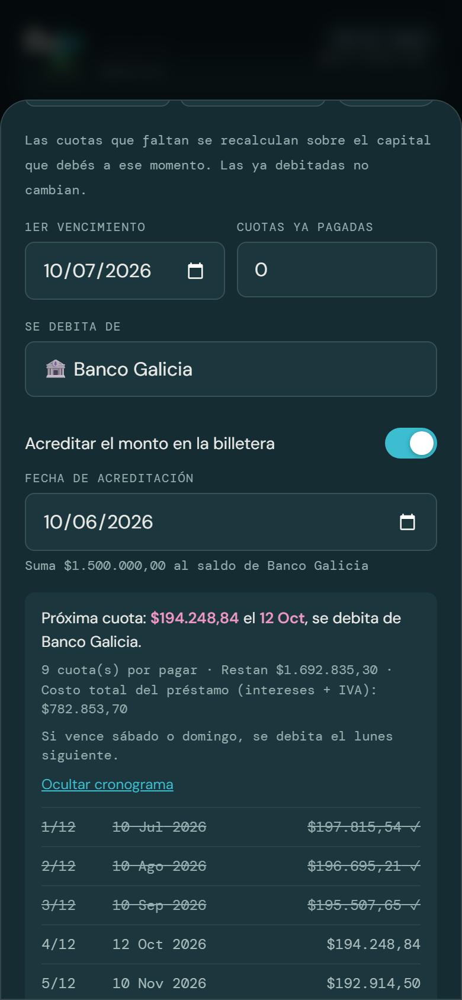
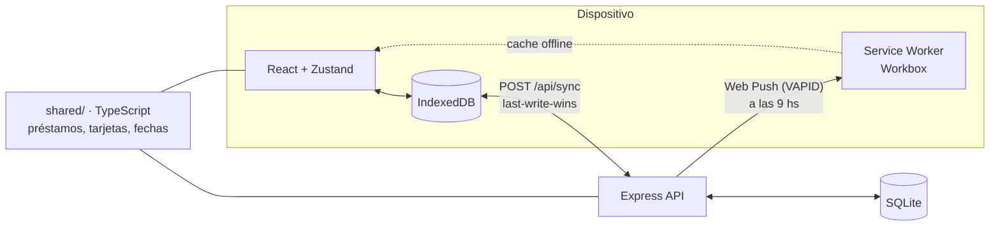
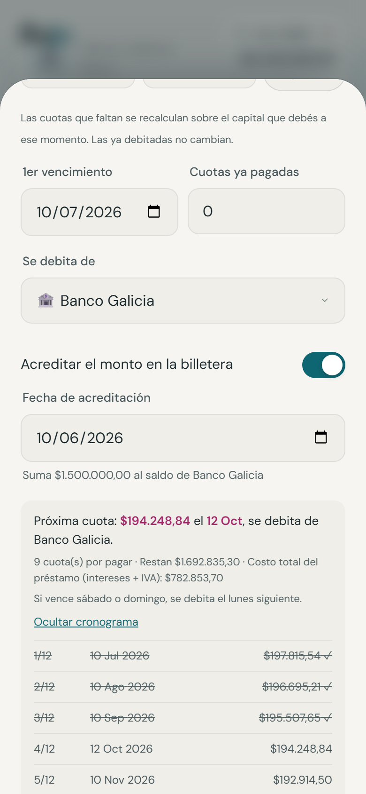
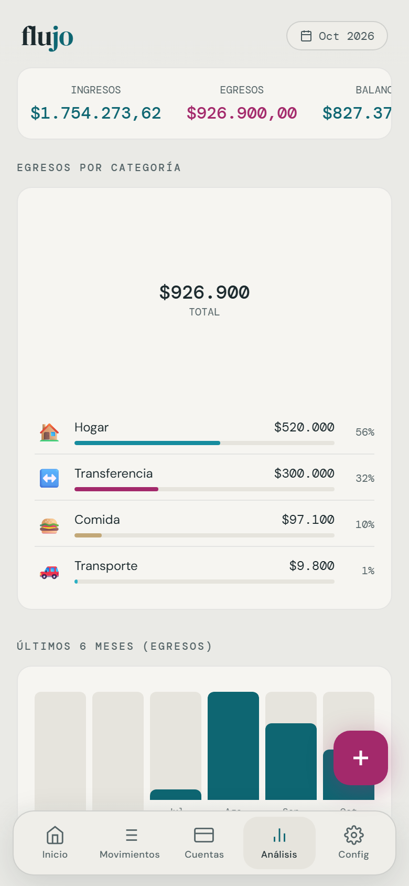
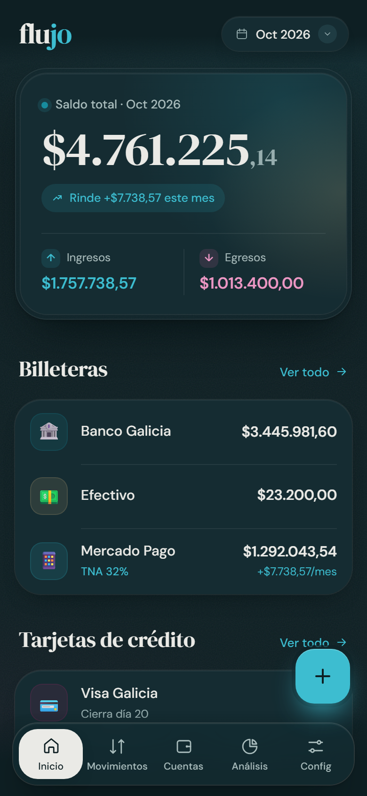
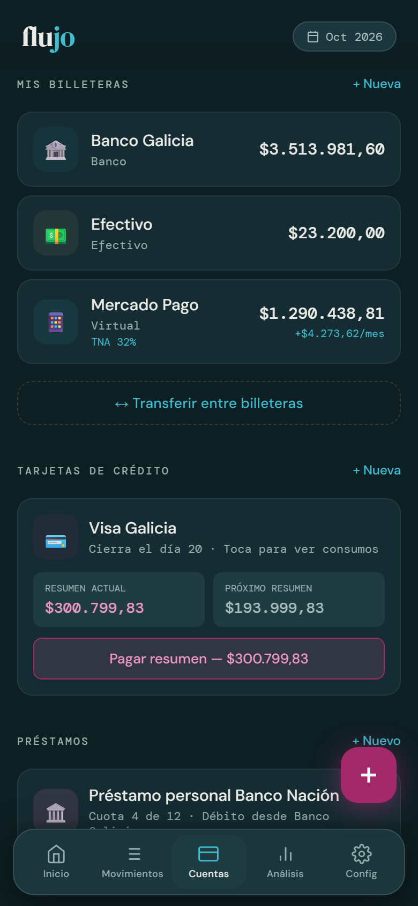
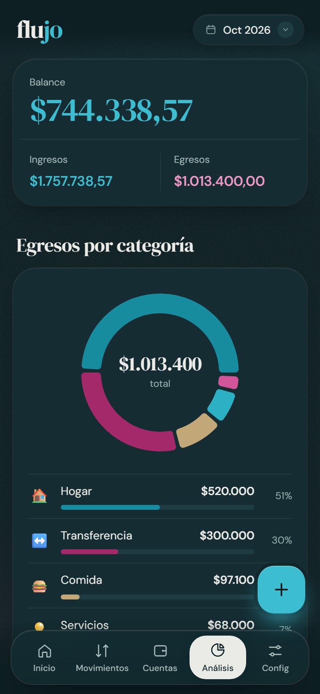

<div align="center">

# flujo

**Tus finanzas, claras.** Una PWA *offline-first* para controlar billeteras, tarjetas en cuotas y préstamos con débito automático, pensada para cómo se usa la plata en Argentina.

[**Probar la demo**](https://flujo-app.up.railway.app/?demo=1) · [App](https://flujo-app.up.railway.app) · [Landing](https://flujo-app.netlify.app)

[](https://github.com/ornemeolans/flujo/actions/workflows/ci.yml)






</div>

> La demo carga datos de ejemplo con fechas relativas a hoy: no hace falta crear una cuenta.

---

## Qué hace

- **Préstamos con débito automático.** Sistema francés con IVA (21%) sobre los intereses, o la cuota informada por el banco. Las cuotas se debitan solas de la billetera al vencer, y si el vencimiento cae en fin de semana pasa al lunes. Admite cambios de tasa desde una cuota: el resto se recalcula sobre el saldo pendiente.
- **Tarjetas de crédito.** Cada consumo cae en el resumen que corresponde según el cierre, que se puede mover un mes puntual. Las cuotas se reparten en los resúmenes siguientes, y al pagar se marcan sin duplicar los egresos del mes.
- **Billeteras con rendimiento.** Interés diario por TNA, respetando la fecha de cada cambio de tasa.
- **Recordatorios push.** Avisos el día antes de cada cuota y 2 días antes del cierre de cada tarjeta, aunque no abras la app.
- **Sin conexión y sincronizada.** Todo funciona offline. Con una cuenta opcional (email o Google), los datos se sincronizan entre dispositivos.
- **Cuidada.** Modo claro y oscuro, instalable, accesible con teclado y lector de pantalla.

## Arquitectura



### Decisiones técnicas

| Decisión | Por qué |
|---|---|
| **IndexedDB como fuente de verdad del dispositivo** | La app abre y funciona sin red. El servidor solo sincroniza, nunca es un requisito. |
| **Sincronización last-write-wins con tombstones** | Cada registro lleva `updatedAt`/`deletedAt`. Los borrados se propagan como registros marcados, y el servidor entrega cambios incrementales con un cursor (`seq`). Es simple y alcanza para un solo usuario con varios dispositivos. |
| **IDs determinísticos para lo que genera la app** | Las cuotas debitadas (`loan-<id>-<n>`) y los rendimientos (`yield-<billetera>-<fecha>`) los genera cada dispositivo al abrirse. Con el mismo id, la sincronización los unifica en lugar de duplicarlos. |
| **Dominio compartido en TypeScript (`shared/`)** | La PWA y el servidor usan el mismo código para calcular vencimientos y montos. Node 24 lo ejecuta sin compilar (type stripping), así que el servidor avisa exactamente lo que el usuario ve. |
| **Fechas en hora local** | `toISOString()` devuelve UTC: en Argentina, después de las 21 hs, ya es el día siguiente. Todo el dominio usa `localISO()`, y el servidor calcula "hoy" con la zona horaria de Argentina. |
| **Saldos calculados, no guardados** | `saldo = inicial + ingresos − egresos`. No hay estado derivado que se pueda desincronizar. |
| **Service worker en modo *prompt*** | La versión nueva se aplica cuando la persona toca "Actualizar", nunca en medio de una carga. |
| **Seguridad de cuentas** | Contraseñas con scrypt, JWT invalidables (`session_version`), enlaces de email de un solo uso guardados como hash. Al vincular Google a una cuenta con email sin verificar, se descarta la contraseña (evita el *pre-hijacking*). |

## Calidad

| | |
|---|---|
| **Tests** | 38 automáticos: **23** de lógica con Vitest (sistema francés, cambios de tasa, resúmenes, fechas, sincronización contra IndexedDB, modo demo), **9** de la API (auth, sync, borrado de cuenta, push) y **6** de punta a punta con Playwright en un celular emulado. |
| **Accesibilidad** | Auditoría con axe (WCAG 2.1 AA) en cada pantalla y en los dos temas como parte de los tests e2e. Contraste de 4.5:1 verificado en todos los tokens de color, navegación completa con teclado, diálogos con manejo de foco, `prefers-reduced-motion`. |
| **Rendimiento** | Lighthouse 97+ (de 82 al empezar): fuentes servidas por la app, code splitting por pantalla (los gráficos solo se descargan en Análisis), compresión y caché inmutable para assets con hash. |
| **CI** | GitHub Actions: tipos, tests, build, e2e + axe y Lighthouse CI con umbrales mínimos sobre la app y la landing. |

## Capturas

| Inicio | Préstamos | Cronograma | Análisis |
|---|---|---|---|
|  |  |  |  |
|  |  |  |  |

## Stack

**Frontend:** React 18, Vite, Zustand, React Router, CSS Modules, Recharts, `idb`, `vite-plugin-pwa` (Workbox).<br/>
**Backend:** Node 24, Express, SQLite (`node:sqlite`), JWT, Google Identity Services, Resend, Web Push.<br/>
**Calidad:** TypeScript (estricto, migración gradual), Vitest, Playwright, axe-core, Lighthouse CI, GitHub Actions.<br/>
**Infra:** Docker, Railway (app + API + volumen SQLite), Netlify (landing).

## Estructura

```
flujo/
├── shared/            # Dominio en TypeScript (PWA + servidor): tipos, préstamos, tarjetas, fechas
├── src/               # PWA
│   ├── db/            # IndexedDB tipada (CRUD, tombstones, export/import)
│   ├── store/         # Zustand: acciones, débitos automáticos, rendimientos, selectores
│   ├── sync/          # Cliente de la API
│   ├── pwa/           # Instalación, conexión, aviso de versión nueva, push
│   ├── components/    # Design system (ui/), modales y layout
│   ├── pages/         # Inicio, Movimientos, Cuentas, Análisis, Config
│   └── demo.ts        # Datos de ejemplo
├── server/            # API Express + SQLite, recordatorios push
├── tests/             # Vitest
├── e2e/               # Playwright (+ generador de capturas)
├── landing/           # Landing estática (Netlify)
└── tools/             # Generación de la imagen Open Graph y WebP
```

## Correr localmente

```bash
npm install
npm install --prefix server
cp server/.env.example server/.env   # completar (ver abajo)

npm run dev          # PWA en http://localhost:5173
npm run dev:server   # API en http://localhost:3001 (Vite redirige /api)
```

| Script | |
|---|---|
| `npm run typecheck` | TypeScript |
| `npm test` | Tests de lógica (Vitest) |
| `npm test --prefix server` | Tests de la API |
| `npm run test:e2e` | Build + tests de punta a punta y accesibilidad (Playwright) |
| `npm run test:all` | Todo lo anterior |

Regenerar capturas e imágenes: `SCREENSHOTS=1 npx playwright test e2e/screenshots.spec.ts && node tools/render-images.mjs`.

### Variables del servidor (`server/.env`)

| Variable | |
|---|---|
| `JWT_SECRET` | Obligatoria en producción (`openssl rand -hex 32`). |
| `GOOGLE_CLIENT_ID` | ID de cliente OAuth web. En "Orígenes autorizados" van `http://localhost:5173` y el dominio de producción. Vacía: solo email y contraseña. |
| `RESEND_API_KEY`, `MAIL_FROM` | Emails de verificación y recuperación. Sin clave, los emails se imprimen en la consola. |
| `APP_URL` | URL pública: los enlaces de los emails apuntan ahí. |
| `VAPID_PUBLIC_KEY`, `VAPID_PRIVATE_KEY`, `VAPID_SUBJECT` | Notificaciones push (`npx web-push generate-vapid-keys`). Sin claves, quedan desactivadas. |
| `CORS_ORIGINS` | Solo si la PWA y la API están en dominios distintos (buildear con `VITE_API_URL`). |

## Deploy

- **App + API (Railway, con Docker):** el `Dockerfile` construye la PWA y la sirve desde Express junto con la API. Necesita un volumen montado en `/data`, donde vive la base SQLite.
- **Landing (Netlify):** importar el repo con *Base directory* `landing`. No tiene build; los headers y redirecciones están en `landing/netlify.toml`.

```bash
docker build -t flujo .
docker run -p 3001:3001 -v flujo-data:/data -e JWT_SECRET=... flujo
```
